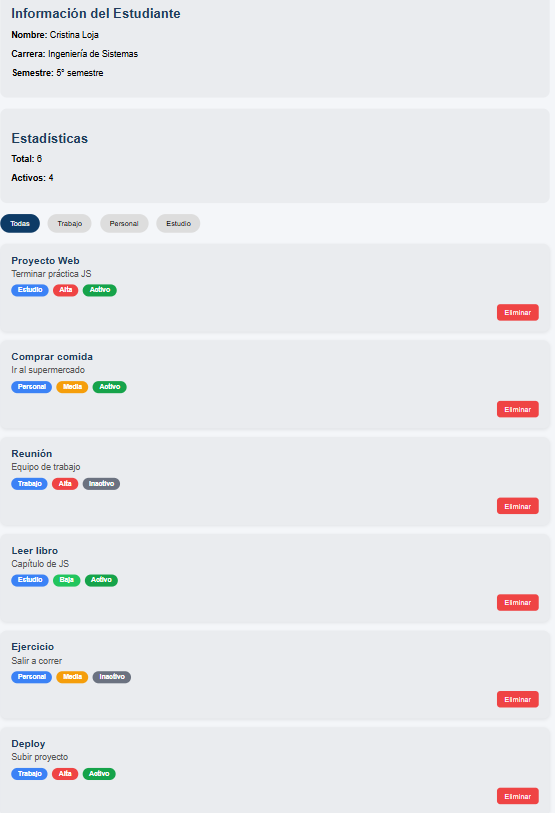
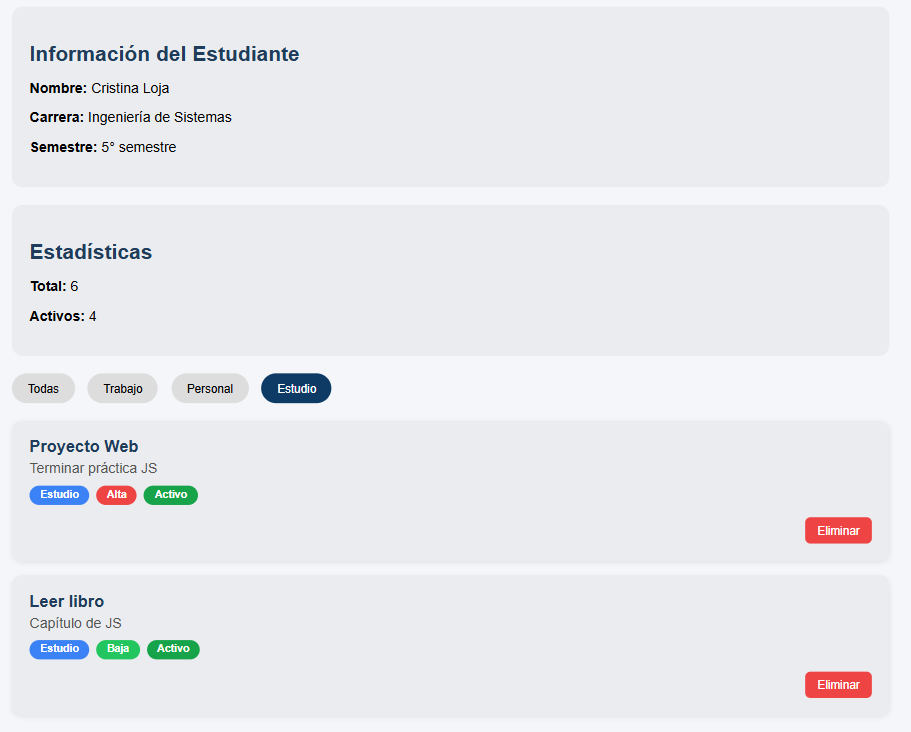

# Práctica 2: Manipulación del DOM

## Descripción de la solución

Esta práctica es un gestor de tareas hecho con JavaScript.
La idea es simple: mostrar información en pantalla y poder interactuar con ella sin recargar la página.

El HTML y parte del JavaScript ya estaban dados.
Lo importante aquí fue trabajar el DOM y aplicar estilos con CSS.

La app permite:

* Ver una lista de tareas
* Filtrar por categoría
* Eliminar tareas
* Ver estadísticas básicas

---

## Estilos CSS

Bueno, aquí es donde está el trabajo fuerte. Tenía que lograr que la app se vea bien y cumpla ciertos requisitos.

### 🔹 Layout con Grid

Usé CSS Grid para organizar las tarjetas:

```css
#contenedor-lista {
  display: grid;
  grid-template-columns: 1fr;
  gap: 15px;
}
```

Y cuando la pantalla es más grande, se muestran en dos columnas:

```css
@media (min-width: 900px) {
  #contenedor-lista {
    grid-template-columns: 1fr 1fr;
  }
}
```

---

### 🔹 Hover en tarjetas

Quería que no se vea tan plano, así que agregué un pequeño efecto:

```css
.card:hover {
  transform: translateY(-3px);
}
```

Nada exagerado, pero mejora bastante.

---

### 🔹 Botón eliminar en rojo

Esto era obligatorio:

```css
.btn-eliminar {
  background: #ef4444;
  color: white;
}
```

Básico, pero claro para el usuario.

---

### 🔹 Filtros activos

Para saber qué filtro está seleccionado:

```css
.btn-filtro-activo {
  background: #0d3b66;
  color: white;
}
```

Así no te pierdes.

---

## Funcionalidades principales

En este caso no voy a mostrar todo el código, pero estas son las funciones clave.

### 🔹 Renderizar lista

```js
renderizarLista(elementos);
```

Esto dibuja las tarjetas en pantalla.

---

### 🔹 Eliminar elementos

```js
eliminarElemento(id);
```

Borra una tarea y vuelve a renderizar.

---

### 🔹 Filtrar

```js
inicializarFiltros();
```

Permite mostrar solo ciertas categorías.

---

## Imágenes

### Vista general



### Filtrado aplicado



---

## Conclusión

En esta práctica se pudo trabajar directamente con el DOM para construir una aplicación dinámica, donde los cambios se reflejan en pantalla sin necesidad de recargar la página.

Se implementaron funciones como el renderizado de datos, el filtrado y la eliminación de elementos, lo que ayuda a entender mejor cómo interactúa JavaScript con el HTML.

Además, el uso de CSS permitió mejorar la presentación visual, aplicando diseño con Grid, efectos hover y un enfoque responsive.

En general, fue una buena forma de pasar de la teoría a algo más práctico y cercano a una aplicación muy real.

### Autor
Cristina Loja
clojap1@est.ups.edu.ec