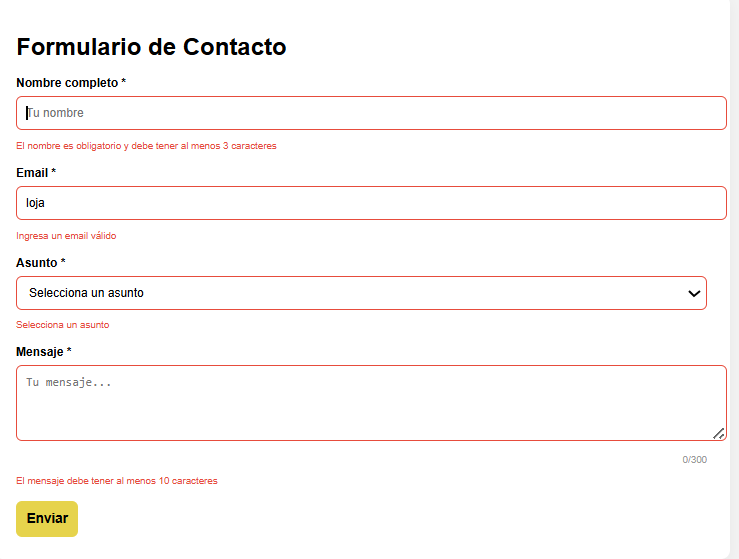
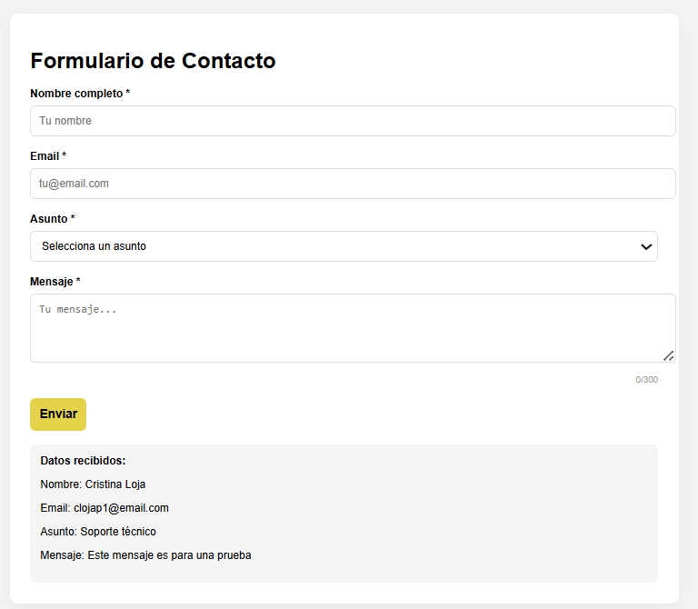
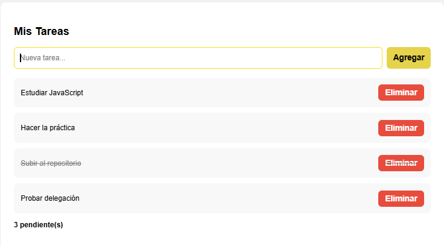
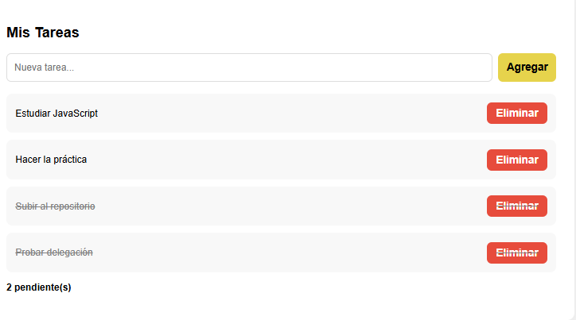
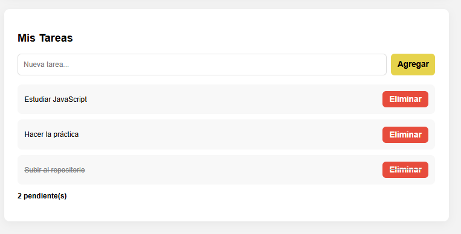
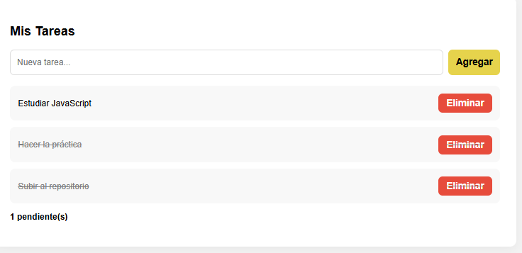
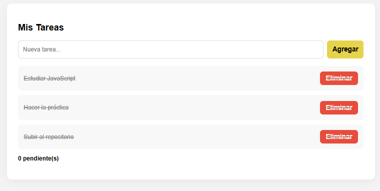

# Práctica 3: Eventos en JavaScript

## Descripción de la solución

En esta práctica se desarrolló una aplicación web interactiva utilizando JavaScript para manejar eventos. El sistema está dividido en dos partes principales:

### 1. Formulario de contacto

* Validación en tiempo real con eventos `blur` e `input`
* Uso de `preventDefault()` para evitar el envío automático del formulario
* Contador de caracteres dinámico en el campo de mensaje
* Visualización de los datos ingresados por el usuario

### 2. Sistema de tareas

* Permite agregar nuevas tareas
* Permite eliminar tareas
* Permite marcar tareas como completadas
* Uso de **event delegation** para manejar todos los eventos con un solo listener
* Contador dinámico de tareas pendientes

Además, se implementó un atajo de teclado (**Ctrl + Enter**) para enviar el formulario de manera rápida.

---

## Código destacado

### Validación del formulario con `preventDefault()`

```javascript
formulario.addEventListener('submit', (e) => {
  e.preventDefault();

  const nombreValido = validarNombre();
  const emailValido = validarEmail();
  const asuntoValido = validarAsunto();
  const mensajeValido = validarMensaje();

  if (nombreValido && emailValido && asuntoValido && mensajeValido) {
    mostrarResultado();
    resetearFormulario();
  }
});
```

---

### Event Delegation en la lista de tareas

```javascript
listaTareas.addEventListener('click', (e) => {
  const action = e.target.dataset.action;

  if (!action) return;

  const item = e.target.closest('li');
  const id = Number(item.dataset.id);

  if (action === 'eliminar') {
    tareas = tareas.filter((t) => t.id !== id);
    renderizarTareas();
  }

  if (action === 'toggle') {
    const tarea = tareas.find((t) => t.id === id);
    tarea.completada = !tarea.completada;
    renderizarTareas();
  }
});
```

---

### Atajo de teclado (Ctrl + Enter)

```javascript
document.addEventListener('keydown', (e) => {
  if (e.ctrlKey && e.key === 'Enter') {
    e.preventDefault();
    formulario.requestSubmit();
  }
});
```

---

## Capturas de funcionamiento

### 🔹 Validación en acción



---

### 🔹 Formulario procesado



---

### 🔹 Event delegation funcionando



---

### 🔹 Contador de tareas actualizado




---

### 🔹 Tareas completadas



---

## Conclusión

En esta práctica se aplicaron conceptos fundamentales de JavaScript como:

* Manejo de eventos (`click`, `input`, `blur`, `keydown`)
* Uso de `preventDefault()`
* Manipulación del DOM
* Event delegation
* Interactividad en tiempo real

El resultado es una aplicación funcional, dinámica y eficiente que responde a las acciones del usuario.

### Autor
Cristina Loja
clojap1@est.ups.edu.ec