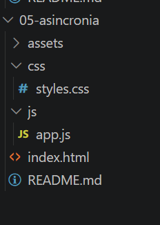
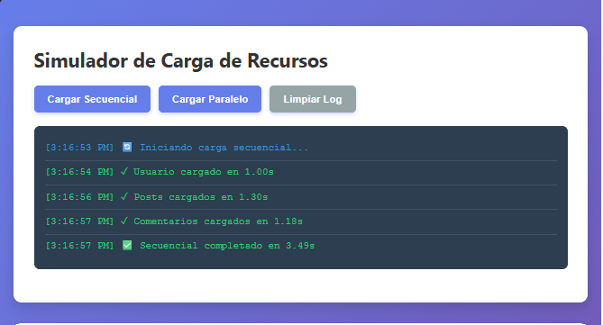
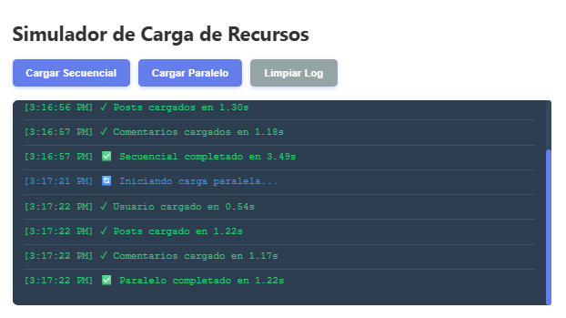
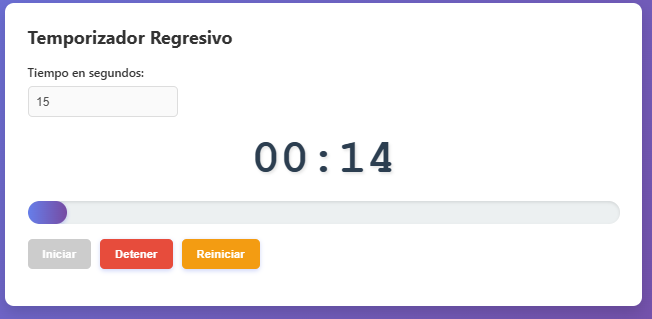
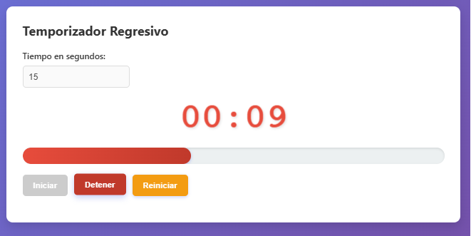
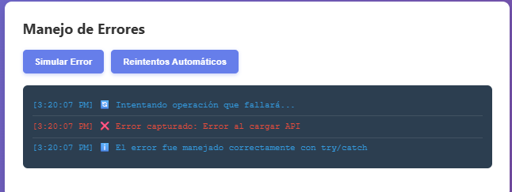
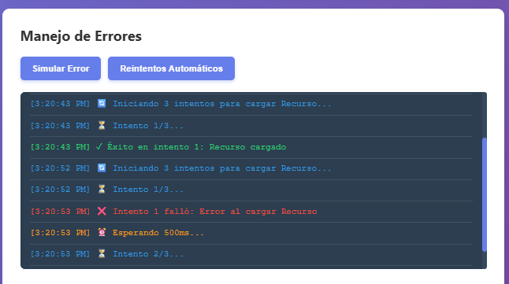
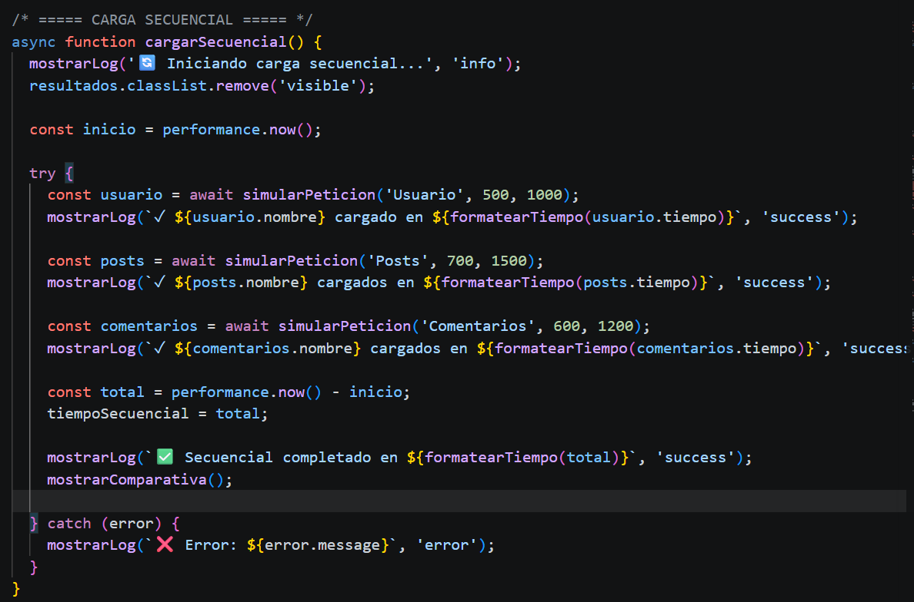
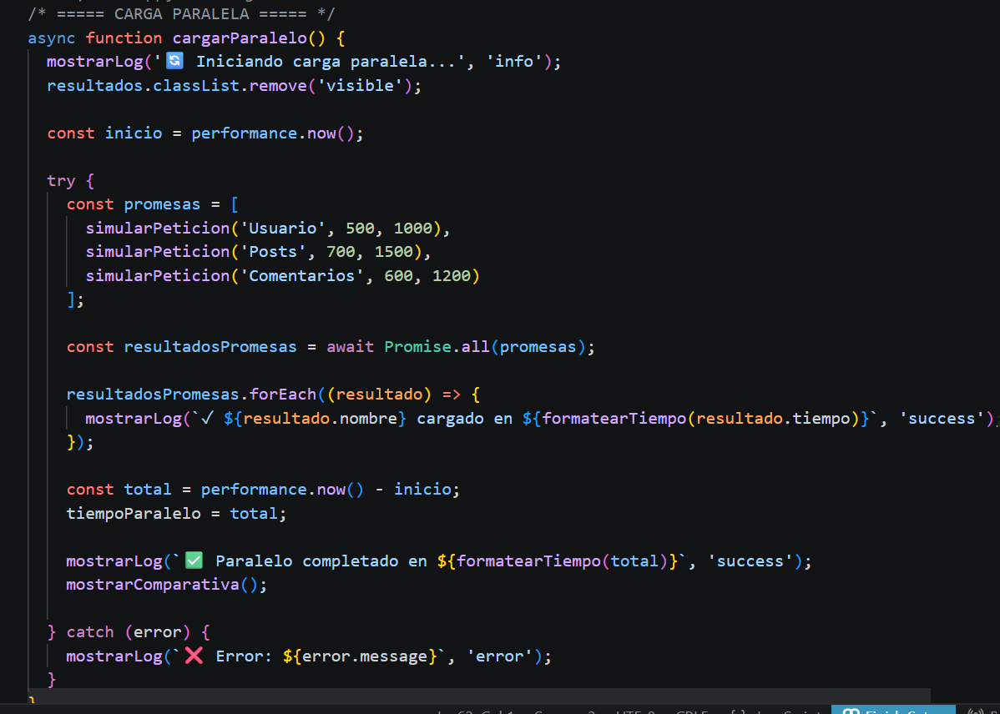

# Práctica 05 - Programación Asíncrona

## Descripción

Bueno, esta práctica trata de entender cómo funciona la asincronía en JavaScript.  
Se implementó un simulador que compara dos formas:

- Carga secuencial (una tras otra)
- Carga paralela (al mismo tiempo)

También incluye:
- Temporizador regresivo
- Manejo de errores
- Reintentos automáticos

La idea es ver cómo mejora el rendimiento.

---

## Resultados y Evidencias

### 1. Estructura del proyecto

**Descripción:**  
Se muestra cómo están organizados los archivos del proyecto.

---

### 2. Carga secuencial

**Descripción:**  
Las peticiones se ejecutan una tras otra.  
Por eso el tiempo total es mayor.

---

### 3. Carga paralela

**Descripción:**  
Las peticiones se ejecutan al mismo tiempo usando Promise.all.  
Esto hace que sea más rápido.

---

### 4. Comparativa de tiempos

**Descripción:**  
La carga secuencial tomó 3.49s (resultado de la suma de delays individuales de cada petición), mientras que la carga paralela se completó en solo 1.22s (el tiempo de la promesa más larga). Esto representa una optimización de 2.27s, siendo un 65.1% más rápido al no bloquear el hilo de ejecución.

---

### 5. Temporizador en acción

**Descripción:**  
El temporizador esta 15. 
Temporizador funcionando con barra de progreso y alerta se pone en roja cuando se pone en 10.

---

### 6. Manejo de errores

**Descripción:**  
El error se captura con try/catch sin romper la app.

---

### 7. Reintentos automáticos

**Descripción:**  
El sistema intenta varias veces cuando falla.

---

### 8. Consola limpia

**Descripción:**  
No hay errores en consola. Todo está controlado.

---

### 9. Código fuente

**Descripción:**  
Uso de async/await y Promise.all.

---

## Código Destacado

### ✔ Función con Promesa

    function simularPeticion(nombre, tiempoMin, tiempoMax, fallar = false) {
      return new Promise((resolve, reject) => {
        const tiempo = Math.random() * (tiempoMax - tiempoMin) + tiempoMin;

        setTimeout(() => {
          if (fallar) {
            reject(new Error(`Error al cargar ${nombre}`));
          } else {
            resolve({ nombre, tiempo });
          }
        }, tiempo);
      });
    }

---

### Carga Secuencial

    async function cargarSecuencial() {
      const usuario = await simularPeticion('Usuario', 500, 1000);
      const posts = await simularPeticion('Posts', 700, 1500);
      const comentarios = await simularPeticion('Comentarios', 600, 1200);
    }

---

### Carga Paralela

    async function cargarParalelo() {
      const resultados = await Promise.all([
        simularPeticion('Usuario', 500, 1000),
        simularPeticion('Posts', 700, 1500),
        simularPeticion('Comentarios', 600, 1200)
      ]);
    }

---

### Manejo de errores

    async function simularError() {
      try {
        await simularPeticion('API', 500, 1000, true);
      } catch (error) {
        console.error(error.message);
      }
    }

---

### Temporizador

    intervaloId = setInterval(() => {
      tiempoRestante--;
      actualizarDisplay();

      if (tiempoRestante <= 0) {
        clearInterval(intervaloId);
      }
    }, 1000);

---

## Análisis

- Secuencial → más lento  
- Paralelo → más rápido  

La paralela puede ser hasta 60% más eficiente.

---

## Conclusión

La asincronía mejora rendimiento y evita bloqueos.  
async/await hace el código más claro y fácil de manejar.

### Autor
Cristina Loja
clojap1@est.ups.edu.ec