# Práctica 6: Fetch API y Consumo de Servicios

## Descripción

Este proyecto es una aplicación web que permite trabajar con posts usando una API.

Se pueden:

* ver posts
* crear nuevos
* editarlos
* eliminarlos
* buscarlos

Todo funciona sin recargar la página.

---

## Tecnologías usadas

* HTML
* CSS
* JavaScript (sin frameworks)
* Fetch API
* JSONPlaceholder

---

## API utilizada

Se usó la API pública:

https://jsonplaceholder.typicode.com

Ejemplo de petición:

```
GET /posts?_limit=20
```

Esto permite traer solo 20 registros.

---

## Funcionalidades

### Cargar posts (GET)

Al iniciar la aplicación, se obtienen los posts desde la API y se muestran en pantalla.

---

### Crear post (POST)

Se puede ingresar un nuevo post desde el formulario.
El post aparece en la lista automáticamente.

---

### Editar post (PUT)

Se puede modificar un post existente.
Los cambios se actualizan en la interfaz.

---

### Eliminar post (DELETE)

Se puede eliminar un post con confirmación previa.

---

### Búsqueda

Permite filtrar los posts por título o contenido.

---

## Estado de carga

Mientras se cargan los datos, se muestra un mensaje:

"Cargando posts..."

junto a un spinner.

---

## Manejo de errores

Si ocurre un error (por ejemplo, falla de conexión), se muestra un mensaje en pantalla.

Ejemplo:
"Error: Failed to fetch"

---

## Peticiones HTTP (Network)

En DevTools se pueden ver las peticiones:

* GET → obtener posts (200)
* POST → crear post (201)
* PUT → actualizar post
* DELETE → eliminar post

También se usa `_limit=20` para limitar resultados.

---

## Manejo de IDs

Los nuevos posts usan un ID generado localmente.

Se toma el ID más alto y se suma 1.

Ejemplo:
si hay 20 posts → el siguiente es 21.

Si se elimina uno, el ID no se reutiliza.

---

## Estructura del código

* `apiService.js` → maneja las peticiones HTTP
* `app.js` → lógica principal
* `components.js` → creación dinámica del HTML

---

## Evidencia

### 1. Datos cargados desde la API

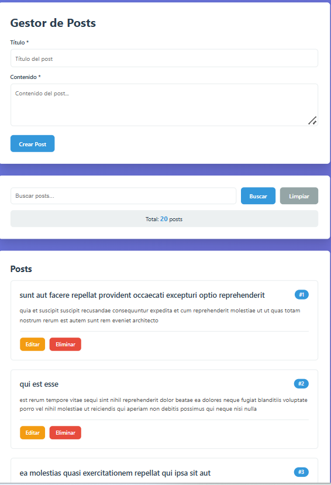
**Descripción:**
Se cargan los posts desde la API usando GET.
Se muestran 20 registros gracias a `_limit=20`.

---

### 2. Estado de carga

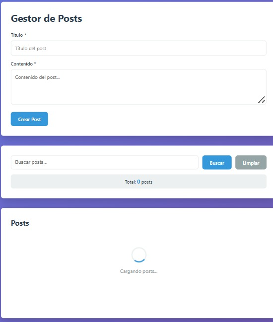
**Descripción:**
Se muestra un spinner mientras se cargan los datos.

---

### 3. Crear post (POST)

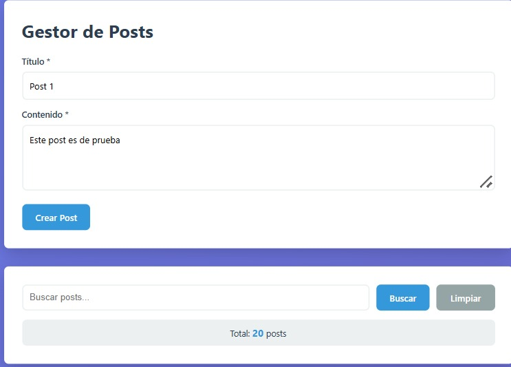
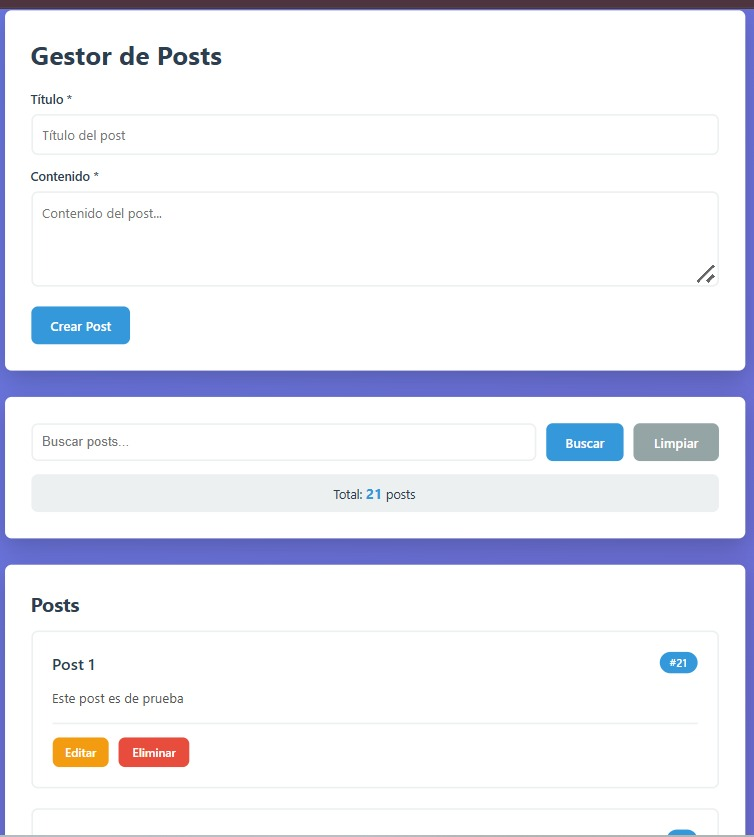
**Descripción:**
Se crea un nuevo post.
Aparece en la lista con ID generado localmente.

---

### 4. Editar post (PUT)

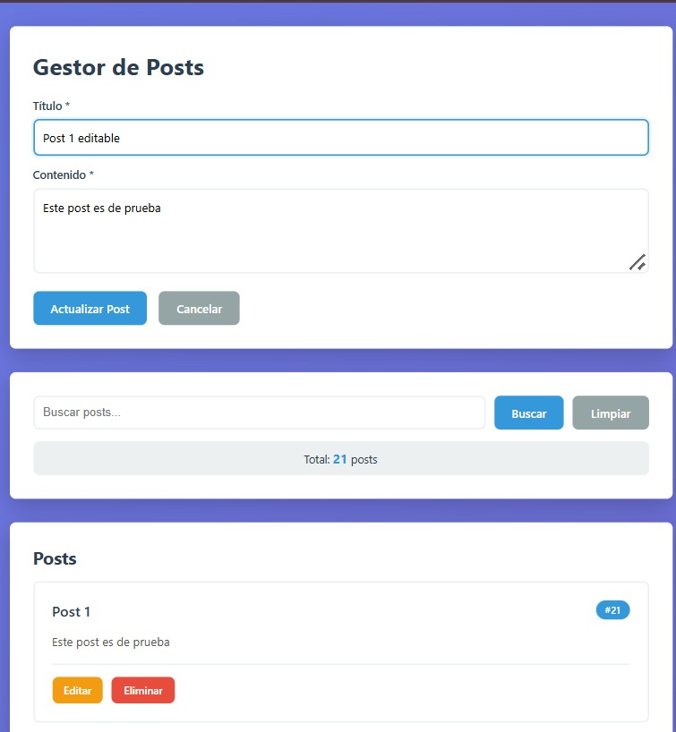
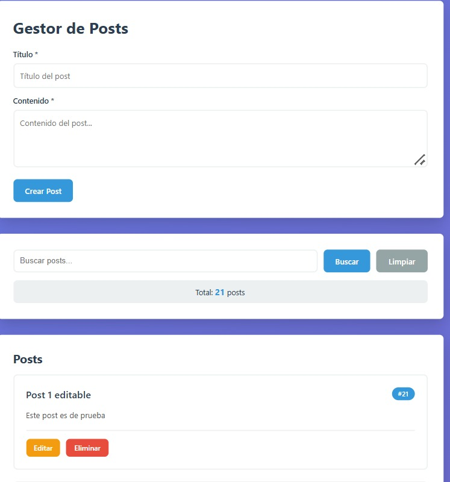
**Descripción:**
Se actualiza un post existente.
Los cambios se reflejan en pantalla.

---

### 5. Eliminar post (DELETE)

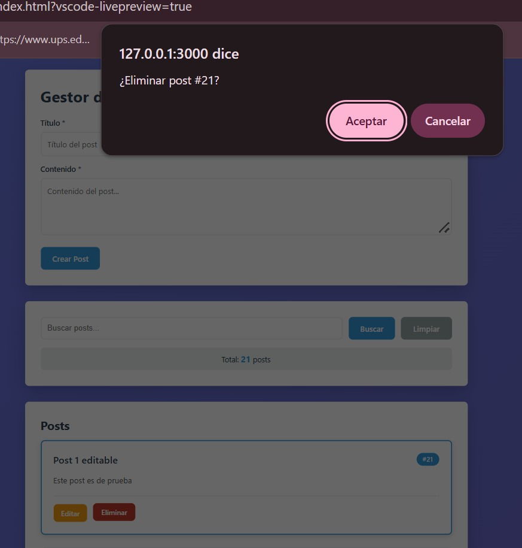
**Descripción:**
Se elimina un post de la lista.

---

### 6. Búsqueda

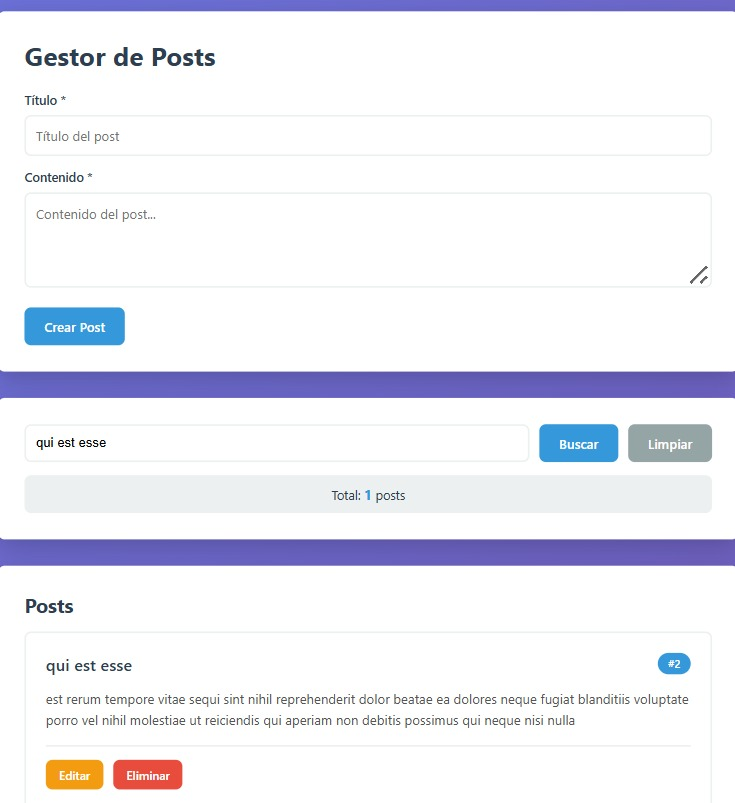
**Descripción:**
Se filtran los posts según el texto ingresado.

---

### 7. Manejo de errores

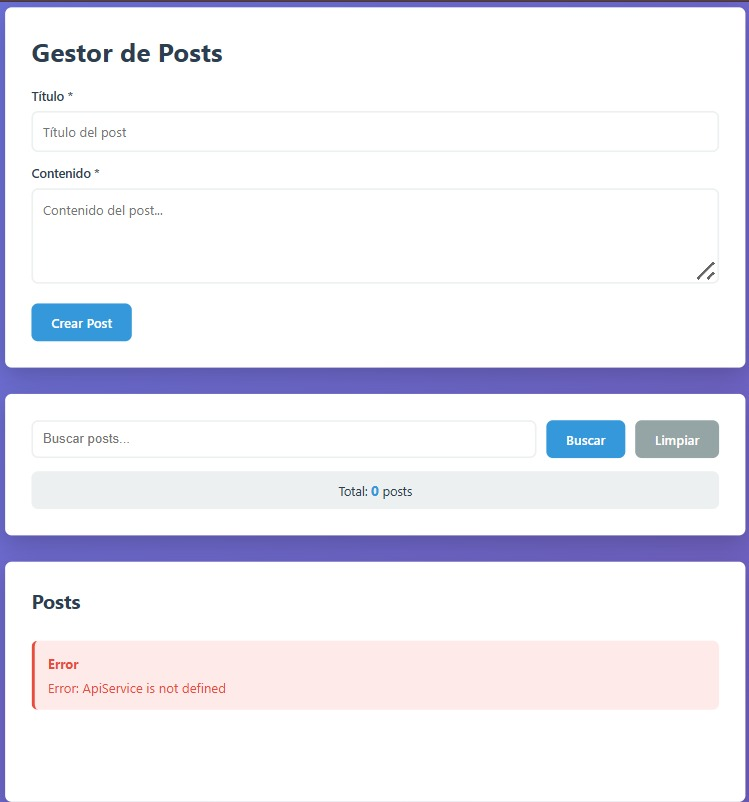
**Descripción:**
Se muestra un mensaje de error cuando falla la API.

---

### 8. Network tab

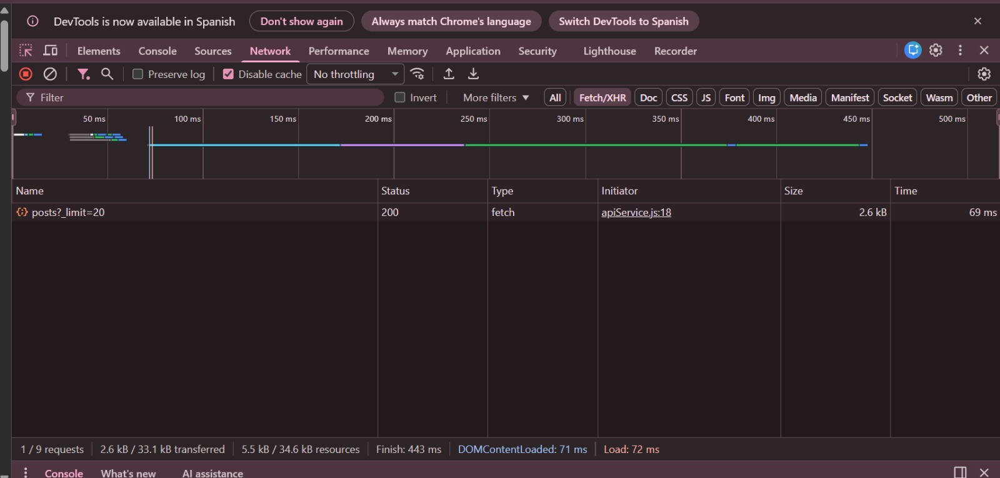
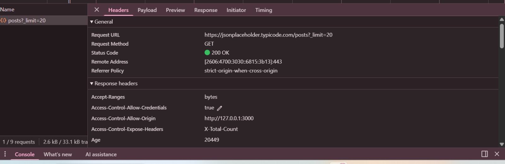
**Descripción:**
Se observan las peticiones HTTP en DevTools.

---

### 9. Código fuente

#### apiService.js

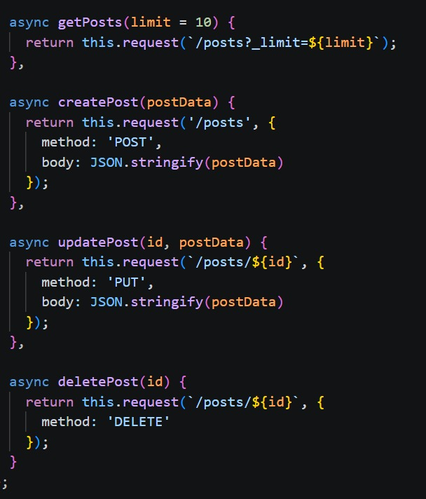
**Descripción:**
Se muestran las funciones encargadas de las peticiones HTTP usando Fetch API:

* getPosts (GET)
* createPost (POST)
* updatePost (PUT)
* deletePost (DELETE)

---

#### app.js

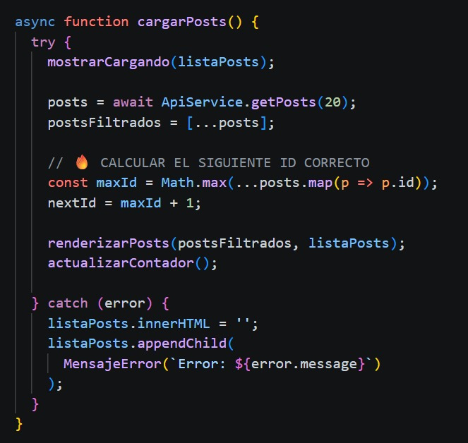
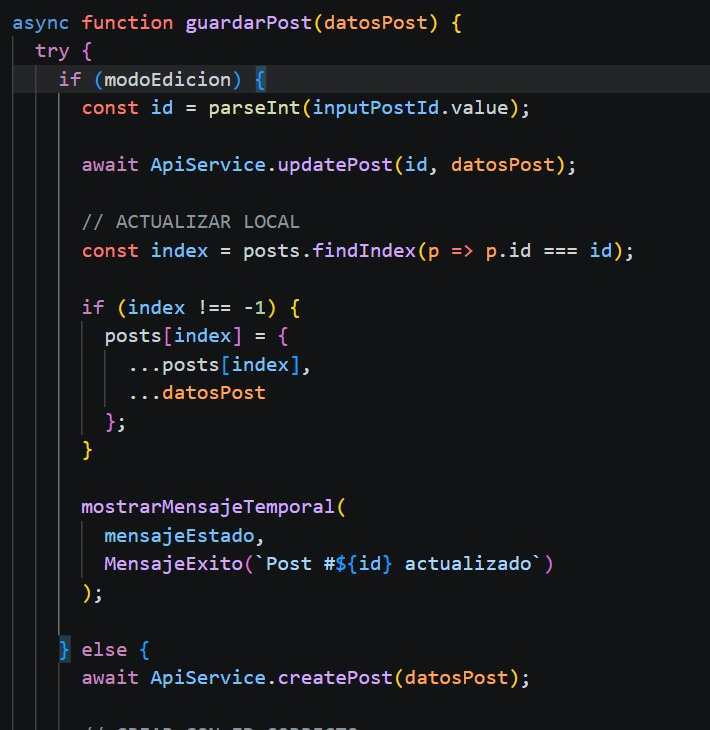
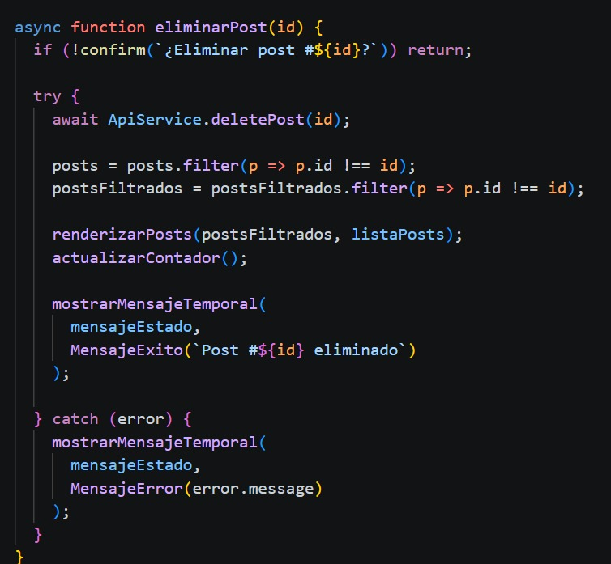
**Descripción:**
Se observa la lógica principal de la aplicación:

* cargarPosts → obtiene los datos
* guardarPost → crea y actualiza posts
* eliminarPost → elimina un post

---

#### components.js

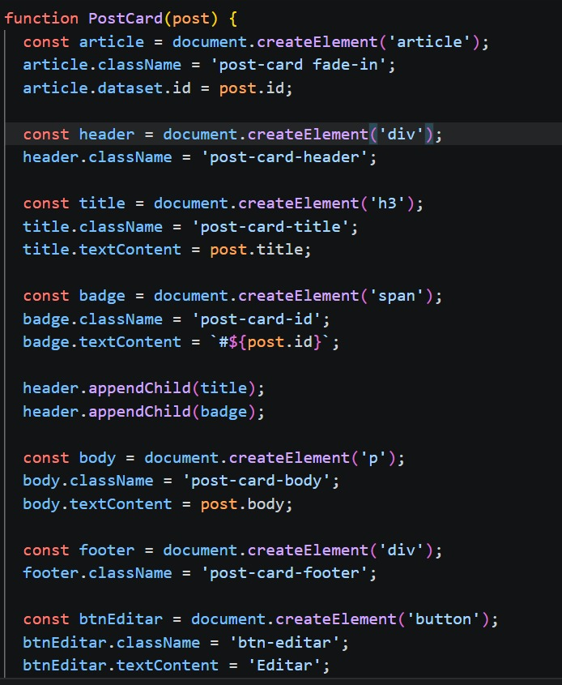
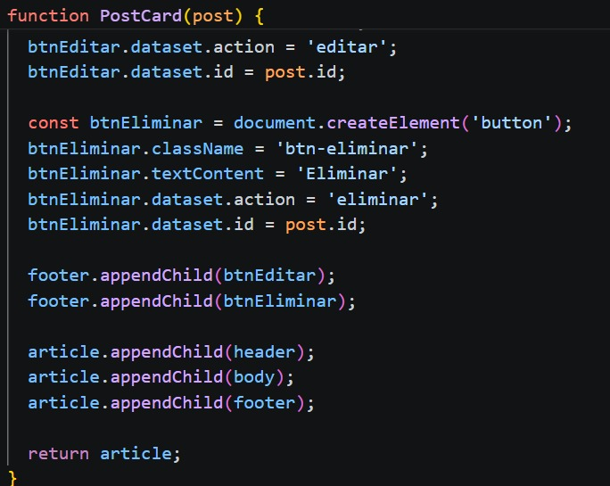
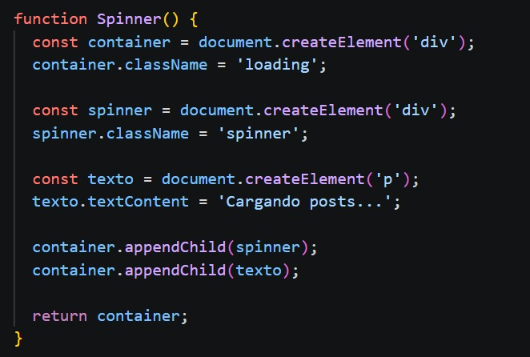
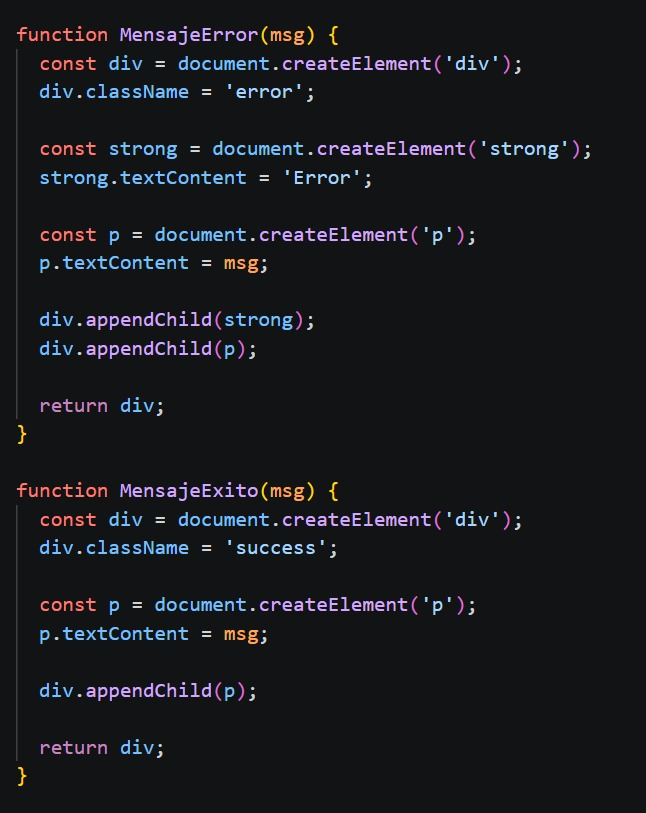
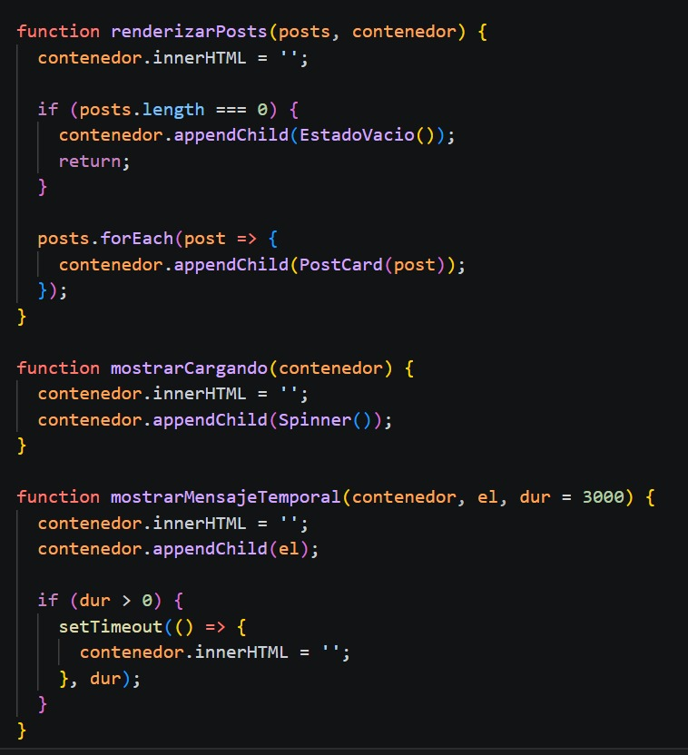
**Descripción:**
Se muestran funciones para crear y renderizar elementos dinámicos:

* PostCard → genera cada post
* renderizarPosts → inserta los posts en el DOM


---

## Conclusión

La aplicación cumple con las operaciones básicas de un CRUD usando Fetch API.

Aunque la API no guarda cambios reales, se manejan los datos localmente para simular el comportamiento completo.

Sirve para entender cómo funciona la comunicación entre frontend y API.


---
## Autora

Cristina Loja

Correo: clojap1@est.ups.edu.ec
