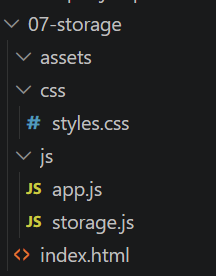
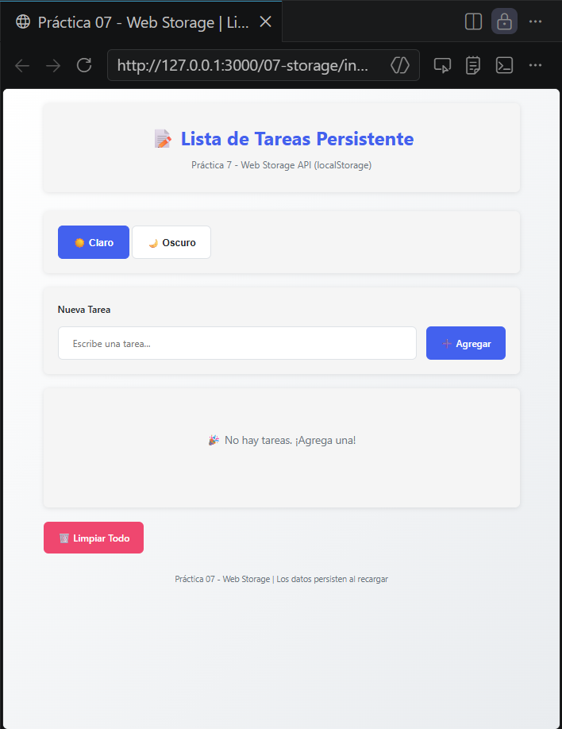
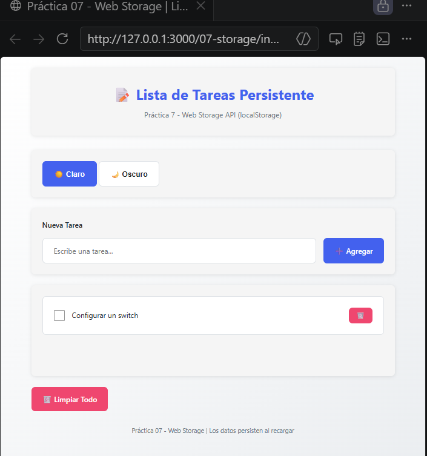
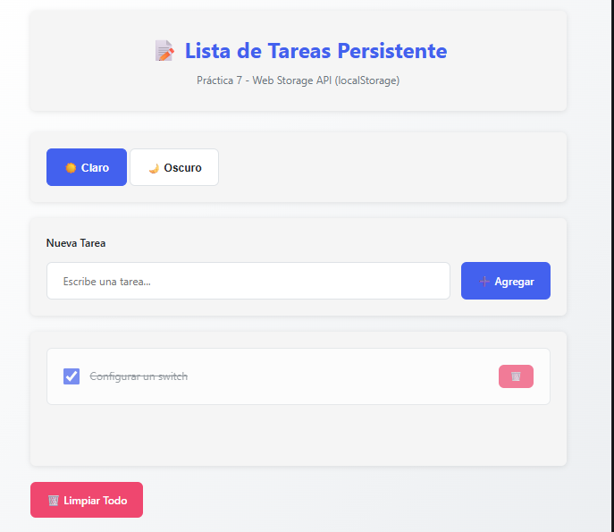
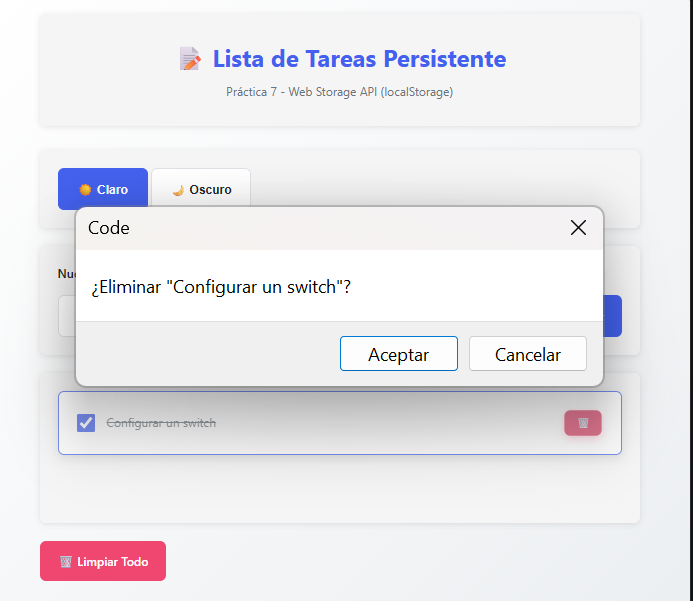
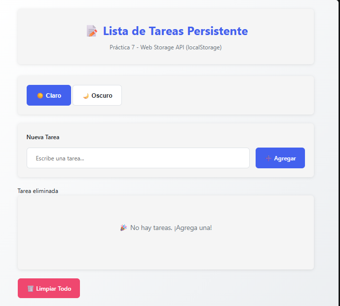
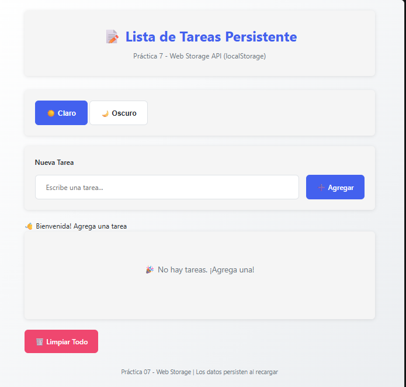
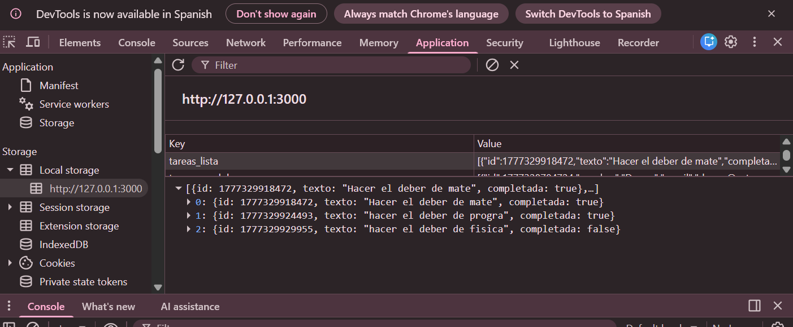
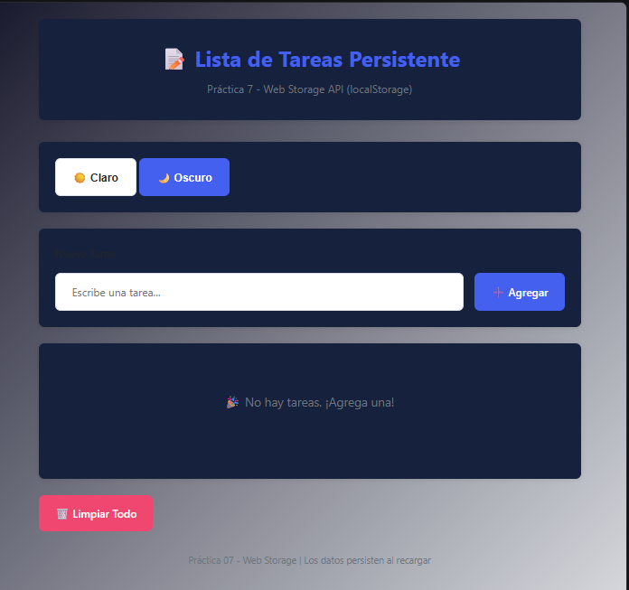

# Práctica 7 - Aplicación de Tareas

## 1. Descripción

Se desarrolló una aplicación web para gestionar tareas usando JavaScript.
Permite agregar, completar y eliminar tareas sin recargar la página.
Los datos se guardan en el navegador usando localStorage.

---

## 2. Funcionalidades

* Agregar tareas
* Marcar tareas como completadas
* Eliminar tareas
* Guardar datos en localStorage
* Mantener información al recargar
* Cambio de tema

---

## 3. Tecnologías usadas

* HTML
* CSS
* JavaScript
* localStorage

---

## 4. Evidencias

### 4.1 Estructura del proyecto

Se muestra la organización de carpetas y archivos del proyecto.

---

### 4.2 Aplicación vacía

La aplicación inicia sin tareas registradas.

---

### 4.3 Agregar tarea

Se ingresa una nueva tarea y se añade a la lista.

---

### 4.4 Tarea completada

La tarea se marca como completada y cambia su estilo visual.

---

### 4.5 Interacción general

Se observa el uso normal de la aplicación con varias tareas.

---

### 4.6 Eliminar tarea

Se elimina una tarea de la lista correctamente.

---

### 4.7 Persistencia de datos

Las tareas se mantienen después de recargar la página.

---

### 4.8 Uso de localStorage

Se visualizan los datos guardados en el navegador.

---

### 4.9 Cambio de tema

La interfaz cambia de apariencia al seleccionar otro tema.

---

---

## 5. Conceptos aplicados

* Manipulación del DOM
* Eventos en JavaScript
* JSON.stringify / JSON.parse
* LocalStorage
* Arquitectura modular básica
* Separación de responsabilidades

## 6. Conclusión

La aplicación funciona correctamente y cumple con lo pedido.
Se aplicaron conceptos de JavaScript como manejo del DOM, eventos y almacenamiento local.

---

## Autora

Cristina Loja

Correo: clojap1@est.ups.edu.ec
