# Práctica 8: Formularios y Validación

## 1. Introducción

En esta práctica trabajé con formularios usando HTML, CSS y JavaScript. La idea principal fue validar los datos antes de enviarlos, para evitar errores y mejorar la experiencia del usuario.

Usé validación con JavaScript en lugar de la validación automática del navegador. Así pude mostrar mensajes personalizados, controlar mejor los errores y validar cosas más específicas, como la confirmación de contraseña o la edad.

También agregué validación en tiempo real, así que el usuario ve los errores mientras escribe y no solo cuando intenta enviar el formulario.

---

## 2. Explicación general

El formulario tiene varios campos: nombre, correo, teléfono, fecha de nacimiento, género, contraseña, confirmación y términos.

Cada campo tiene sus propias reglas. Por ejemplo:

* El nombre debe tener al menos 3 caracteres
* El correo debe tener formato válido
* El teléfono debe tener 10 dígitos
* La contraseña debe incluir mayúsculas, minúsculas y números
* La confirmación debe coincidir con la contraseña
* El usuario debe ser mayor de edad

La validación se hace con funciones en JavaScript. Primero se valida cada campo individual y luego todo el formulario antes de enviarlo.

Además, el sistema muestra errores con bordes rojos y campos correctos con bordes verdes. También hay un indicador que muestra qué tan fuerte es la contraseña.

De paso, agregué autoguardado con sessionStorage. Así, si recargas la página, los datos no se pierden. Eso es útil, la verdad.

---

## 3. Evidencias

### 3.1 Formulario vacío

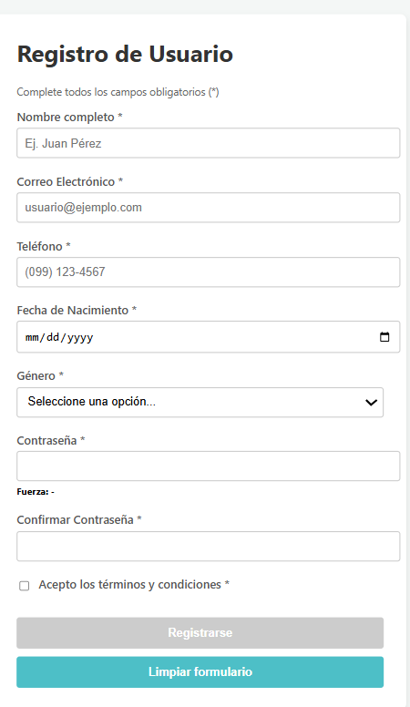

**Descripción:**
Se muestra el formulario al inicio, sin datos ingresados. Todo está listo para empezar.

---

### 3.2 Errores de validación

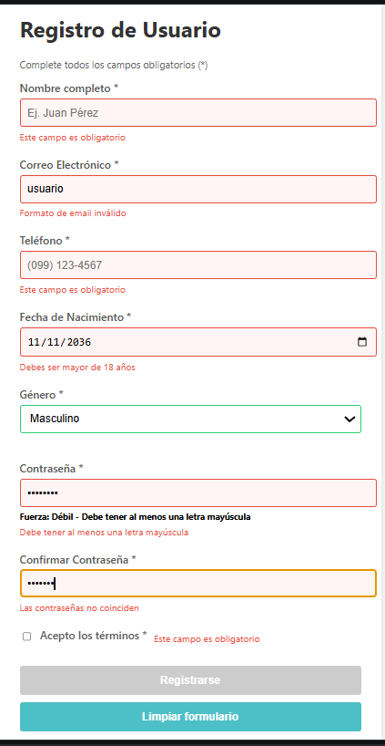

**Descripción:**
Se intenta enviar el formulario vacío. Aparecen mensajes de error y bordes rojos en los campos.

---

### 3.3 Campos válidos

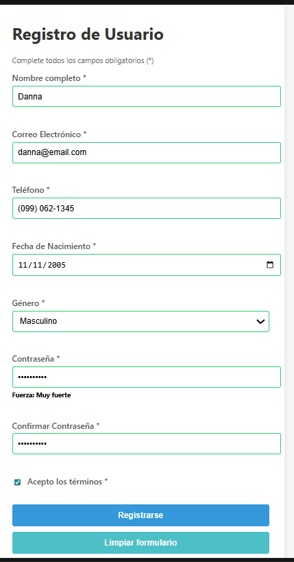

**Descripción:**
Todos los campos están correctamente llenos. No hay errores y los bordes cambian a verde.

---

### 3.4 Contraseña débil

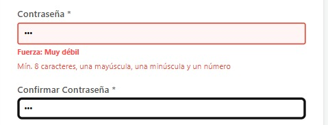

**Descripción:**
Se ingresa una contraseña simple. El sistema la detecta como débil.

---

### 3.5 Contraseña media

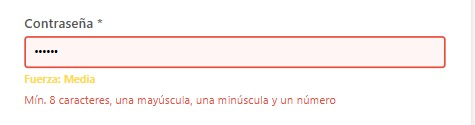

**Descripción:**
La contraseña mejora un poco. El sistema la marca como nivel medio.

---

### 3.6 Contraseña fuerte

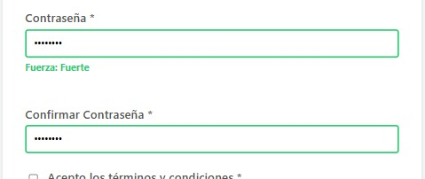

**Descripción:**
La contraseña cumple todos los requisitos. Se muestra como fuerte.

---

### 3.7 Error en confirmación

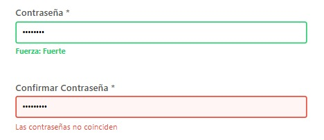

**Descripción:**
Las contraseñas no coinciden. Se muestra el mensaje de error correspondiente.

---

### 3.8 Envío exitoso

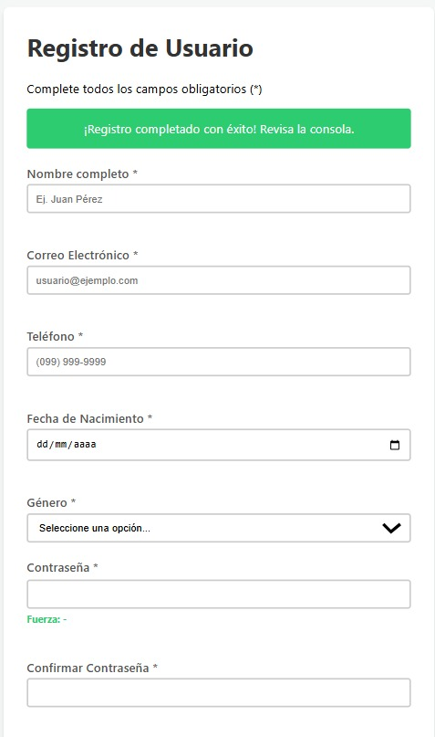
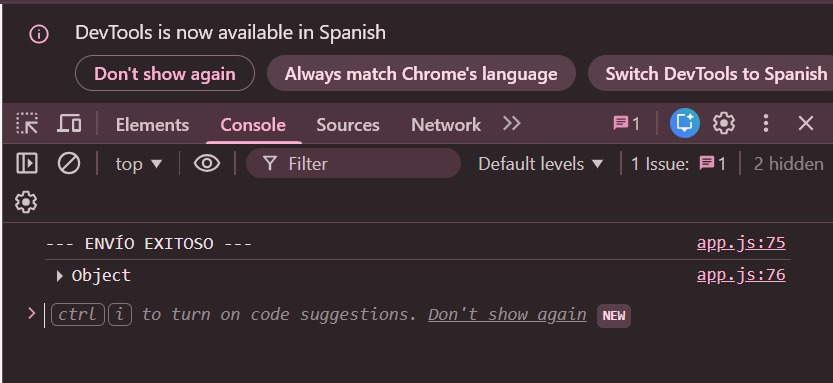

**Descripción:**
El formulario se envía correctamente. Se muestra mensaje de éxito y los datos en consola.

---

### 3.9 Autoguardado

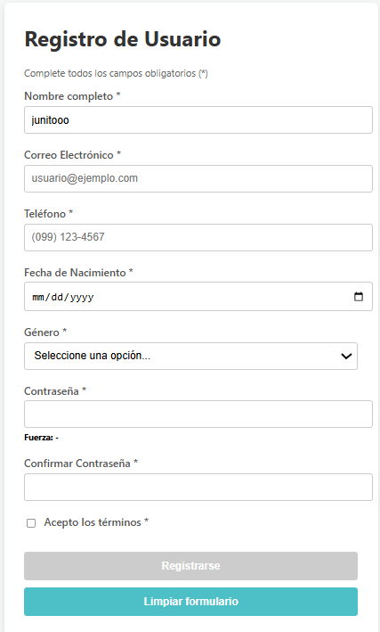

**Descripción:**
Después de escribir datos y recargar la página, la información se mantiene. Esto se logra con sessionStorage.

---

## 4. Código

### 4.1 Función validarCampo

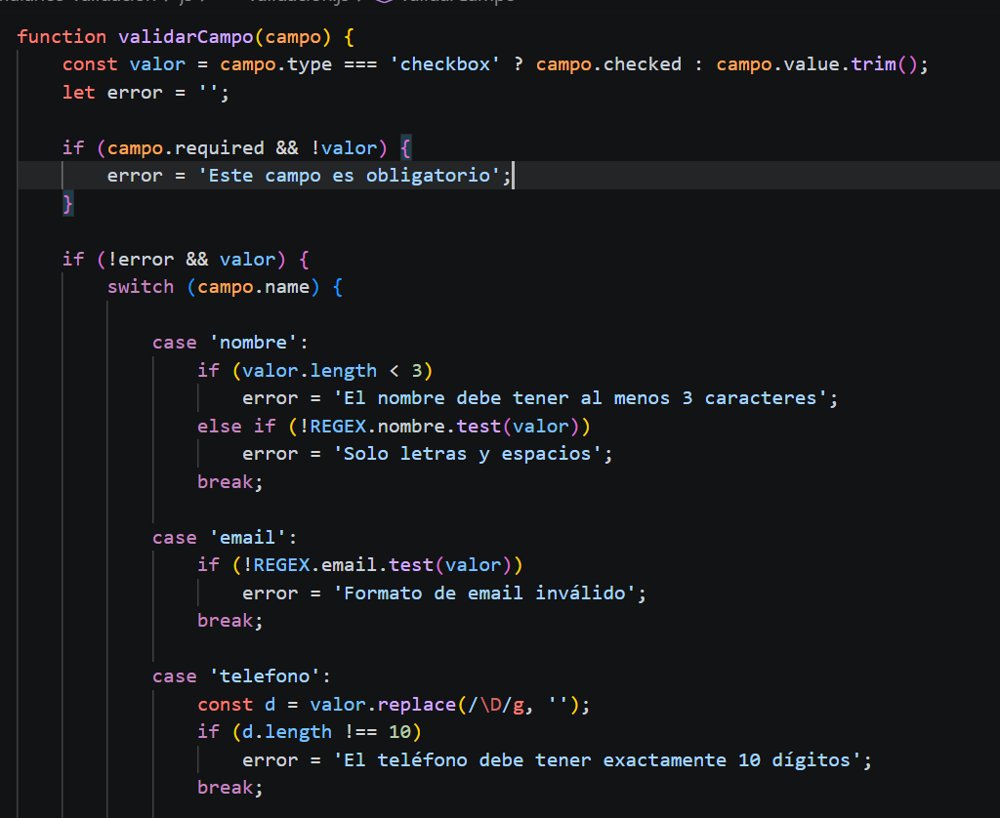
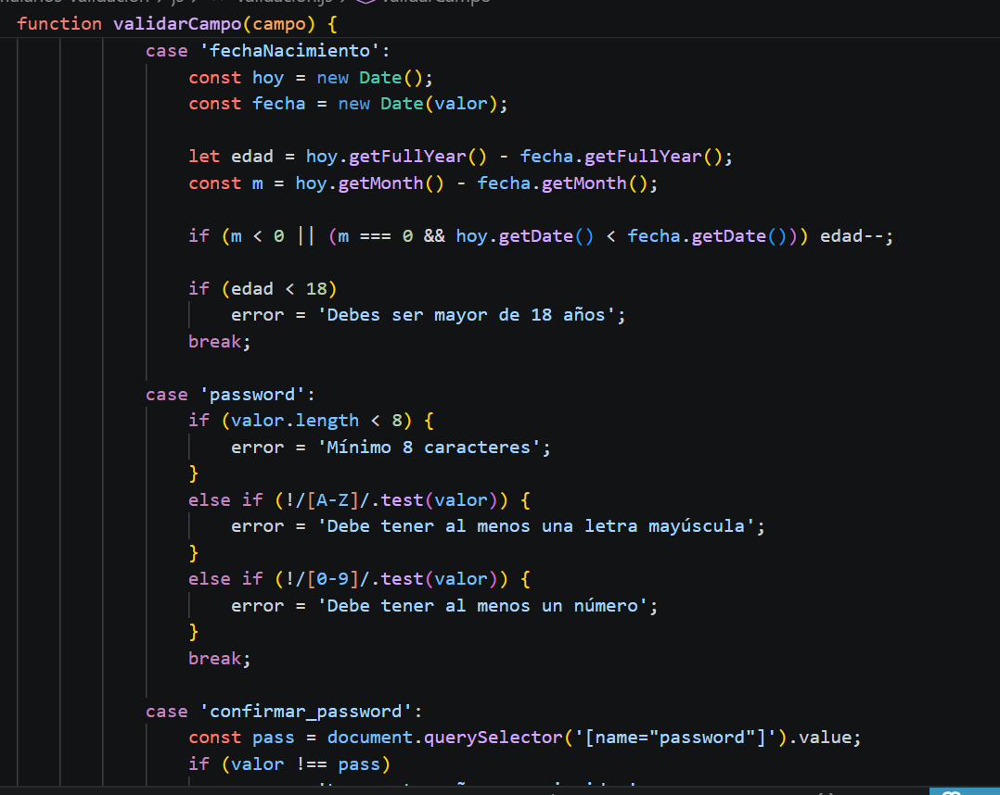
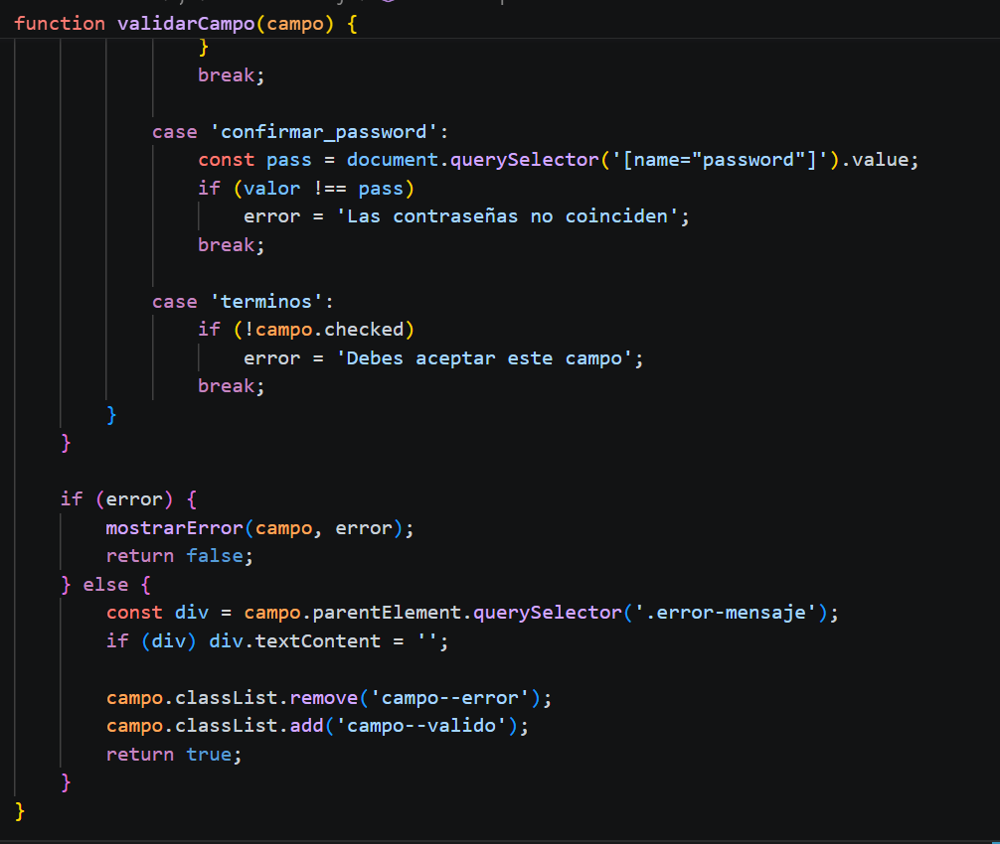

**Descripción:**
Esta función valida cada campo individual según su tipo y reglas.

---

### 4.2 Función validarFormulario

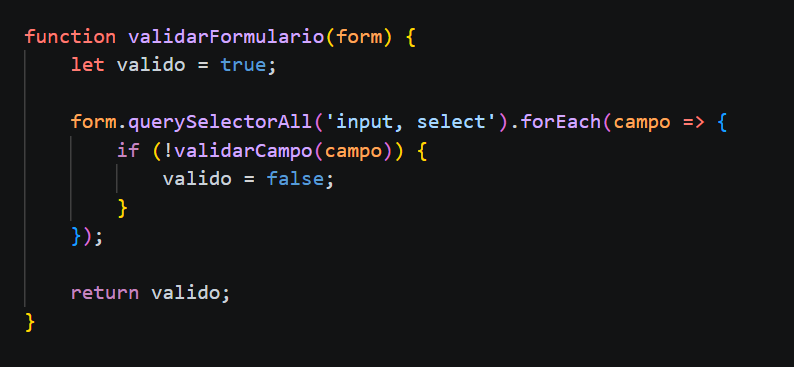

**Descripción:**
Valida todo el formulario antes del envío. Recorre cada campo y verifica que sea válido.

---

### 4.3 Evento focusout

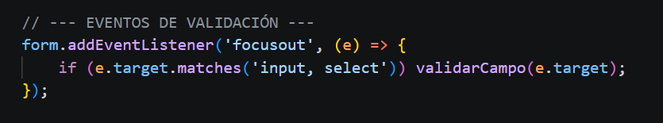

**Descripción:**
Se activa cuando el usuario sale de un campo. Sirve para validar en tiempo real.

---

### 4.4 Evento input

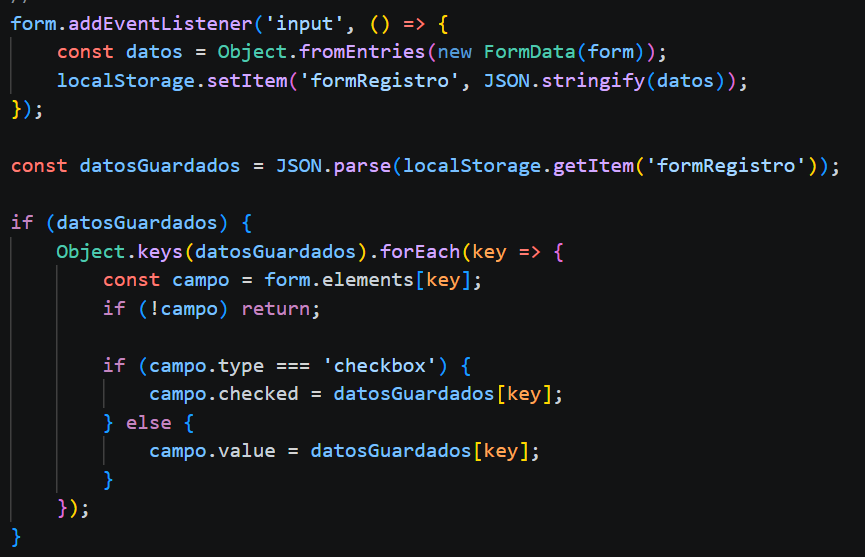

**Descripción:**
Se ejecuta mientras el usuario escribe. Limpia errores y guarda datos automáticamente.

---

### 4.5 Evento submit

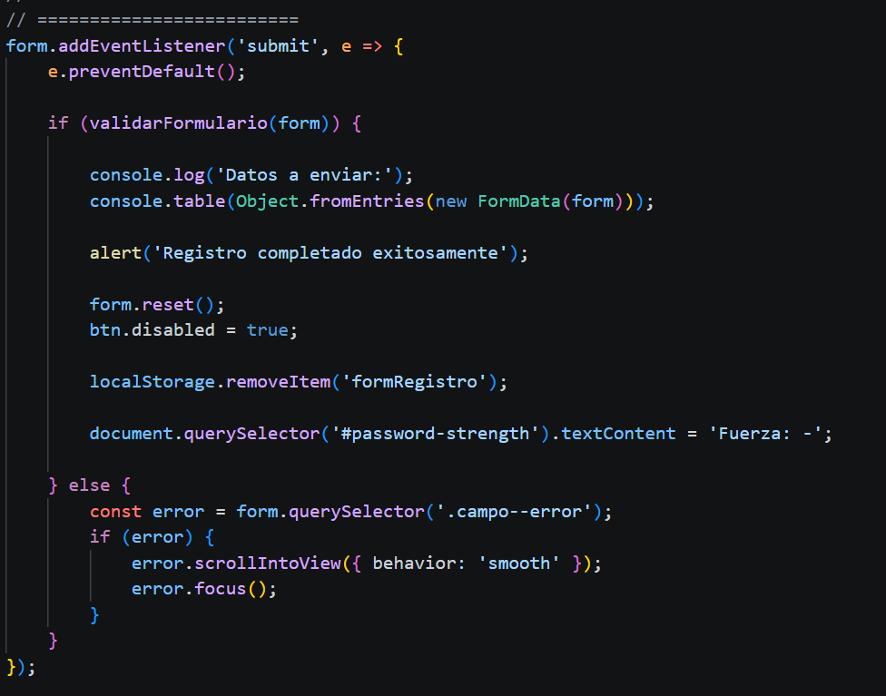

**Descripción:**
Controla el envío del formulario. Evita el envío si hay errores.

---

## 5. Conclusión

En esta práctica logré implementar un formulario completo con validación personalizada usando JavaScript.

El sistema valida en tiempo real, muestra errores claros y evita envíos incorrectos. Además, incluye mejoras como autoguardado y control de seguridad en contraseñas.

En general, el formulario funciona bien y cumple con todos los requisitos pedidos.

---

## Autora

Cristina Loja

Correo: clojap1@est.ups.edu.ec
